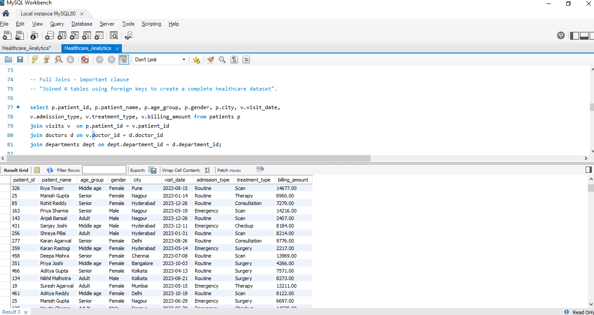
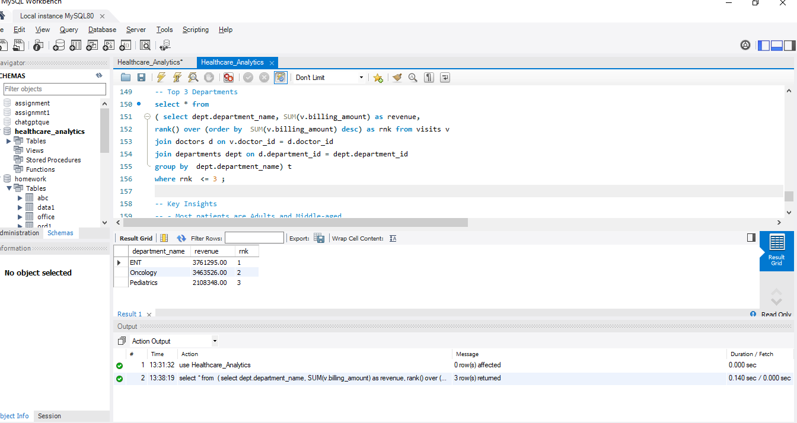

# 🏥 Healthcare Analytics using SQL

This project focuses on analyzing healthcare-related data using SQL to generate meaningful business insights from patient visits, departments, doctors, and billing information.

---

# 📌 Project Objective
The objective of this project is to perform healthcare data analysis using SQL queries, data cleaning techniques, joins, aggregations, and analytical functions.

---

# 🗄️ Database Used
## Healthcare_Analytics

---

# 📋 Tables Created
- Patients
- Departments
- Doctors
- Visits

---

# 🛠️ SQL Concepts Used
- CREATE DATABASE & TABLES
- Primary Keys & Foreign Keys
- Joins
- Aggregate Functions
- GROUP BY & ORDER BY
- Data Cleaning
- Window Functions
- Filtering & Sorting

---

# 🔍 Key Tasks Performed
- Created relational database schema
- Imported CSV datasets using Table Data Import Wizard
- Cleaned data (null values, duplicates)
- Joined multiple healthcare tables
- Generated analytical insights using SQL queries

---

# 📸 Query Output Screenshots

## 🔗 FULL JOIN Query Output
Displays combined records from multiple healthcare-related tables using FULL JOIN.

---

## 🪟 Joins & Window Function Output
Shows analytical SQL query results using joins and window functions.

---

# 📈 Key Insights
- Most patients belong to Adult and Middle-aged categories
- Few departments generated major revenue (ENT, Oncology, etc.)
- Some cities showed higher patient counts (Kolkata, Nagpur, etc.)
- Many patients were repeat visitors

---

# 🧰 Tools Used
- SQL
- MySQL Workbench

---

# 📂 Repository Contents

| File Name | Description |
|------------|-------------|
| `Healthcare_Analytics.sql` | SQL queries used for healthcare analytics |
| `joins_windowfunction_output.png` | Screenshot of joins and window function output |
| `Fulljoin_query_output.png` | Screenshot of FULL JOIN query output |
| `README.md` | Project documentation |

---

# 🚀 How to Use
1. Download the SQL file from this repository.
2. Open it in MySQL Workbench or any SQL environment.
3. Execute the queries step-by-step.
4. Analyze the generated outputs and insights.

---

# 🎯 Skills Demonstrated
- SQL Query Writing
- Database Design
- Data Cleaning
- Data Analysis
- Analytical Thinking
- Healthcare Data Interpretation

---

# ✅ Final Conclusion
This project helped strengthen my SQL, analytical thinking, database management, and healthcare data analysis skills through real-world data exploration.

---

# 👩‍💻 Author
## Smita Patil  
### Aspiring Data Analyst

